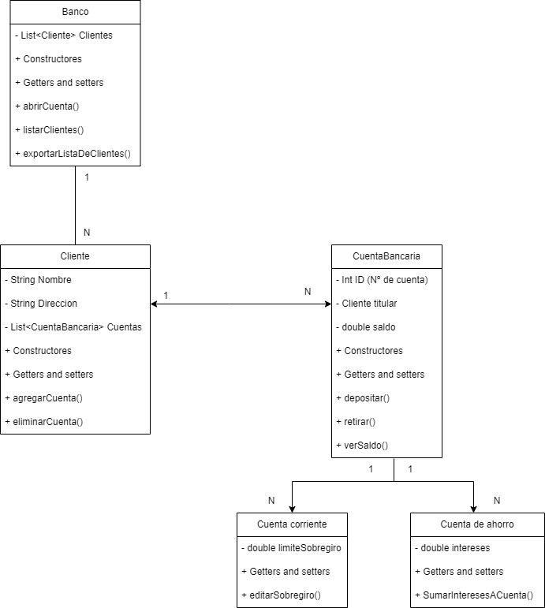

## Sistema Bancario | T.P Nº 1 Java | Informatorio - 2023

## Java - Maven

### Descripción del Escenario:
- Un cliente del banco puede tener múltiples cuentas. Cada cliente tiene un nombre, dirección
y una lista de cuentas bancarias. Pueden agregar o eliminar cuentas y consultar el saldo
total de sus cuentas. 
- De las cuentas bancarias se tiene la información de número de
cuenta, titular y saldo. Cada cuenta tiene un número único y un titular. También tiene
métodos para depositar, retirar y consultar el saldo. 
- Tenemos dos tipos de cuentas
bancarias :
  - Cuenta de ahorro : Las cuentas de ahorro pagan intereses a una tasa
  específica. Deberás implementar un método para calcular y agregar intereses
  al saldo. 
  - Cuenta corriente : Las cuentas corrientes pueden tener un límite de
  sobregiro y deben manejar retiros que excedan el saldo disponible.
- El sistema principal es el Banco, el cual contiene una lista de clientes. Los clientes pueden
  registrarse en el banco. El banco ofrece los servicios como son abrir cuentas y gestionar a
  los clientes.
- El sistema debe tener una funcionalidad que permite exportar en un csv las cuentas
bancarias del banco. En las columnas del csv se debe ver :
  - Número único del titular
  - Nombre de titular
  - Saldo
  - Tipo
- El listado del archivo tiene que estar ordenado por número único del titular y por saldo.
  Recordar que un usuario (Un número único) puede tener varias cuentas.
  
### Requerimientos:
- Investigar cómo funcionan las cuentas de ahorro y cuenta corriente, en base a esto
  realizar la implementación de las funcionalidades del sistema.
- Aplicar los principios de POO en base a lo investigado.
- Realizar una descripción de lo investigado.
- En base a los conocimientos de POO, la investigación realizada, identificar las
  entidades del sistema y representarlo en un diagrama de clases.
- Implementarlo en java usando como gestor del proyecto a MAVEN.

------------------------------------------------------------------------------------------------------------------------
## Sistema bancario Print-Line

El sistema se gestiona por terminal, desde un menú para seleccionar las acciones que se desean realizar.
Como gestor del sistema uno puede:
- Crear / eliminar / consultar clientes.
- Crear / eliminar / consultar cuentas bancarias de clientes.
- Depositar / retirar / ver saldos de cuentas.
- Exportar lista de clientes a csv, con detalle de cuentas.
- Editar límite de sobregiro para cuentas corrientes.
- Editar porcentaje de intereses para cuentas de ahorro.
- Agregar intereses generados en saldo de cuenta de ahorro.
   
### Diagrama Entidad Relación

